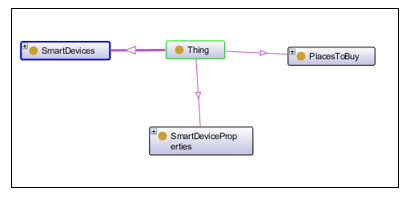
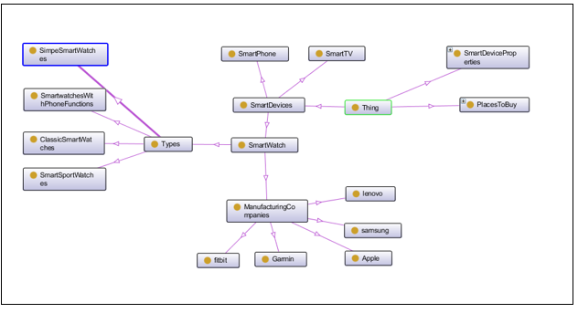

# COCO-CHATBOT

## Description:
Coco is the chat bot to go to if you have any questions about smart watches.

## Chatbot Domain
Answering users’ questions about smart watches. 

   

### Ontology of smart device properties:

## Human evaluation
From our evaluation of the chatbot performance, the following was noticed:

•	When the chatbot welcomes the user and asks for his name, some names are not recognized.

•	When the user asks for the reason to buy smart watches, one reason will be presented to the user, then if the user asks for more reasons another one will be presented, but if the user keeps writing more the chatbot gets into fallback intent and does not understand what the user is saying.

